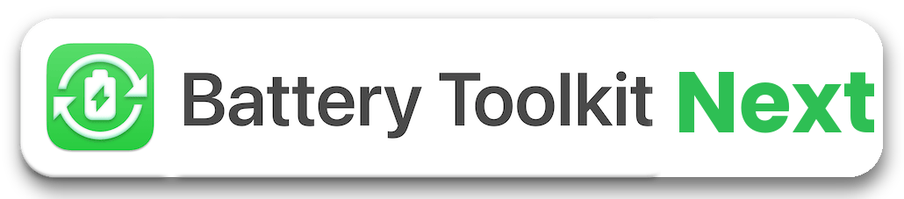

<p align="center">
 
</p>

<p align="center">Control the platform power state of your Apple Silicon Mac.</p>

<p align="center"><b>Battery Toolkit Next</b> is a fork of <a href="https://github.com/mhaeuser/Battery-Toolkit">Battery Toolkit</a> by Marvin Häuser, with support for macOS 15.8 firmware charge-limit controls and signed, notarized releases.</p>

<p align="center"><a href="#features">Features</a> &bull; <a href="#install">Install</a> &bull; <a href="#usage">Usage</a> &bull; <a href="#uninstall"> Uninstall </a> &bull;<a href="#limitations"> Limitations </a> &bull; <a href="#technical-details"> Technical Details </a> &bull; <a href="#building"> Building </a> &bull; <a href="#donate"> Donate </a></p>

-----

# Differences from Battery Toolkit

* **macOS 15.8 support**: firmware updates shipped with macOS 15.8 remove the
  charging switches used by Battery Toolkit 1.8. Battery Toolkit Next detects
  the replacement firmware charge-limit controls and uses them instead (see
  [below](#macos-158-compatibility)). Older charging controls remain supported.
  This support was created by [Oleh Faizulin](https://github.com/ofaizulin).
* **Signed and notarized**: releases are signed with a Developer ID
  certificate and notarized by Apple, so they open without Gatekeeper
  workarounds.
* **Separate identity**: the app, daemon and all bundle identifiers use the
  `com.delfuria` prefix, so Battery Toolkit Next does not replace or reuse
  the installation of the original app.

> [!WARNING]
> Do not run Battery Toolkit and Battery Toolkit Next at the same time. Both
> daemons control the same charging hardware and would override each other.
> Uninstall the original app first (see [Switching from Battery Toolkit](#switching-from-battery-toolkit)).

# Features

## Limits battery charge to an upper limit

Modern batteries deteriorate more when always kept at full charge. For this reason, Apple introduced the “Optimized Charging“ feature for all their portable devices, including Macs. However, its limit cannot be changed, and you cannot force charging to be put on hold. Battery Toolkit Next allows specifying a hard limit past which battery charging will be turned off. For safety reasons, this limit cannot be lower than 50&nbsp;%.

## Allows battery charge to drain to a lower limit

Even when connected to power, your Mac's battery may slowly lose battery charge for various reasons. Short battery charging bursts can further deteriorate batteries. For this reason, Battery Toolkit Next allows specifying a limit only below which battery charging will be turned on. For safety reasons, this limit cannot be lower than 20&nbsp;%.

**Note:** This setting is not honoured for cold boots or reboots, because Apple Silicon Macs reset their platform state in these cases. As battery charging will already be ongoing when Battery Toolkit Next starts, it lets charging proceed to the upper limit to not cause further short bursts across reboots.

## Allows you to disable the power adapter

If you want to discharge the battery of your Mac, e.g., to recalibrate it, you can turn off the power adapter without actually unplugging it. You can also have Battery Toolkit Next disable sleeping when the power adapter is disabled.

**Note:** Your Mac may go to sleep immediately after enabling the power adapter again. This is a software bug in macOS and cannot easily be worked around.

||
|:--:| 
| **Fig. 1**. *Power Settings* |

## Grants you manual control

The Battery Toolkit Next "Commands" menu and its menu bar extra allow you to issue various commands related to the power state of your Mac. These include:
* Enabling and disabling the power adapter
* Requesting a full charge
* Requesting a charge to the specified upper limit
* Stopping charging immediately
* Pausing all background activity

||
|:----------|
| **Fig. 2**. *Menu Bar Extra* |

# Install

> [!IMPORTANT]
> Battery Toolkit Next only supports Apple Silicon Macs.

1. Go to the GitHub [releases](https://github.com/delfuria/Battery-Toolkit/releases/latest) page
2. Download the latest non-dSYM build (i.e., `Battery-Toolkit-Next-X.Y.zip`)
3. Unzip the archive
4. Drag `Battery Toolkit Next.app` into your Applications folder
5. Open it; the app is notarized, so no Gatekeeper workaround is needed

### Switching from Battery Toolkit

If the original Battery Toolkit is installed, remove it first:

1. Open Battery Toolkit
2. Choose "Disable Background Activity" from its main menu
3. Quit it and move `Battery Toolkit.app` to the Trash

Settings are not migrated, because Battery Toolkit Next uses different
identifiers. Configure the limits again after installing.

### macOS 15.8 compatibility

Some firmware updates installed with macOS 15.8 remove the charging switches
used by Battery Toolkit 1.8, causing “Your Mac is not supported.” Battery
Toolkit Next detects the replacement firmware charge-limit controls and
supports a lower and upper charging threshold through them. Compatibility
depends on the controls actually accessible on the Mac, not just its macOS
version.

For a 30–80% setup, set **Turn battery charging on below** to **30%** and the
upper threshold to **80%**, and leave the power adapter enabled. Charging
limits do not issue an adapter-disable command. The firmware enforces the
range during sleep, and the daemon checks it on wake and while running.

If the battery is already above 80%, the app automatically sustains near its
current level: for example, 87% becomes a temporary ceiling. It does not
change the configured 80% limit. After natural battery use brings the charge
back to 80% or below, the normal 30–80% range takes over again. Manual
charge-to-limit and charge-to-full commands remain available.

> [!IMPORTANT]
> The replacement controls are not identical to the old charging switch:
> firmware may briefly charge or discharge while settling around the sustain
> target. An exact, constant displayed percentage and zero battery current
> are not guaranteed. Sustaining near 87%, the full 30–80% cycle and sleep
> behavior still need hardware validation. See
> [compatibility and validation notes](Docs/macOS-15.8.md).

# Usage

> [!CAUTION]
> To ensure there is no chance of interference, please turn “Optimized Charging” **off** when Battery Toolkit Next is in use. <br>
>  Go to macOS System Settings > Battery > the (i) next to Battery Health > Optimized Battery Charging > toggle off

1. Open Battery Toolkit Next from your Applications folder
2. The menu bar will change to show the app menus, and a menu bar extra will should be visible
3. Configure the settings through either method (see **Fig. 2, 3, 4**)

|||
|:----------|:----------|
| **Fig. 3**. *Main Menu* | **Fig. 4**. *Menu Bar Commands* |

If you prefer, you can quit the GUI to hide the menu bar extra and Battery Toolkit Next will keep running in the background.
If you want to change any settings, simply re-open the app.

# Uninstall

1. Focus Battery Toolkit Next
2. Open the main Battery Toolkit Next menu in the menu bar (see **Fig. 3**)
3. Choose "Disable Background Activity"
4. Move the app to the Trash and empty it

# Limitations

On older firmware, Battery Toolkit Next disables sleep while it is charging,
because it has to actively disable charging once reaching the maximum. Sleep
is re-enabled once charging is stopped for any reason, e.g., reaching the
maximum charge level, manual cancellation, or unplugging the MacBook. On
firmware with native charge-limit controls, the firmware enforces the range
and Battery Toolkit Next does not need to disable sleep for charging.

Apps, including Battery Toolkit Next, cannot control the charge state when the machine is shut down. If the charger remains plugged in while the Mac is off, the battery will charge to 100&nbsp;%.

Note that sleep should usually be disabled when the power adapter is disabled, as this will exit Clamshell mode and the machine will sleep immediately if the lid is closed. Refer to the toggle in the Settings dialog (see **Fig. 1**).

# Technical Details

* Based on IOPowerManagement events to minimize resource usage, especially when not connected to power
* Support for macOS Ventura daemons and login items for a more reliable experience

## Security
* Privileged operations are authenticated by the daemon
* Privileged daemon exposes only a minimal protocol via XPC
* XPC communication uses the latest macOS codesign features

# Building

See [Building the app](Docs/macOS-15.8.md#building-the-app) for signing
requirements. Signed and notarized release packages are produced with:

```sh
Tools/release.sh <notarytool-keychain-profile>
```

# Credits
* [Battery Toolkit](https://github.com/mhaeuser/Battery-Toolkit) by Marvin Häuser, on which this fork is based
* macOS 15.8 support (firmware charge-limit backend and automatic sustain above the limit) created by
  [Oleh Faizulin](https://github.com/ofaizulin) in
  [ofaizulin/Battery-Toolkit](https://github.com/ofaizulin/Battery-Toolkit)
* Icon based on [reference icon by Streamline](https://seekicon.com/free-icon/rechargable-battery_1)
* README overhauled by [rogue](https://github.com/realrogue)
* Replacement firmware charge-limit protocol investigated by
  [ashwinr64](https://github.com/actuallymentor/battery/pull/469) and documented
  in [batt](https://github.com/charlie0129/batt/blob/master/pkg/smc/charging.go)

# Donate
The original author of Battery Toolkit writes: For various reasons, I will not accept personal donations. However, if you would like to support my work with the [Kinderschutzbund Kaiserslautern-Kusel](https://www.kinderschutzbund-kaiserslautern.de/) child protection association, you may donate [here](https://www.kinderschutzbund-kaiserslautern.de/helfen-sie-mit/spenden/).
